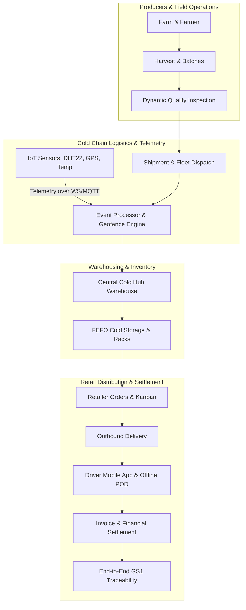

# AgriSupply Platform Architecture Documentation

## 1. System Overview

The **AgriSupply Chain & Smart Cold-Chain Logistics Platform** is an enterprise-grade SaaS system orchestrating agricultural produce from origin farm through quality inspection, temperature-monitored refrigerated transit, warehouse cold storage, retailer distribution, and digital proof of delivery.



---

## 2. Multi-Tenant Architecture & Data Isolation

The platform enforces strict tenant-level isolation across all 32 relational tables and real-time streaming channels.

1. **Database-Level Isolation**:
   - Every domain entity contains a foreign key `tenant_id REFERENCES tenants(id) ON DELETE CASCADE`.
   - SQLite/PostgreSQL composite indexes (e.g. `idx_batches_tenant`, `idx_orders_tenant`) optimize queries scoped by `tenant_id`.
2. **API Middleware Isolation**:
   - `authenticate` extracts and validates the tenant ID from the signed JWT access token.
   - `enforceTenant` middleware intercepts every request, validates tenant subscription status, and sets `req.tenantId`.
   - Any query attempting cross-tenant access is rejected with `403 Forbidden`.
3. **WebSocket Multi-Tenant Broadcast Isolation**:
   - Real-time rooms are namespaced by tenant: `${tenantId}:${channel}`.
   - Socket clients only receive alerts, GPS updates, and order changes belonging to their authenticated tenant.

---

## 3. Role-Based Access Control (RBAC)

The platform implements 10 specialized enterprise roles:

| Role | Operational Scope | Key Permissions |
|---|---|---|
| **Super Admin** | System-wide | Multi-tenant provisioning, subscription control, health telemetry, full audit logs |
| **Tenant Admin** | Tenant-wide | User provisioning, warehouse config, vehicle registration, financial reporting |
| **Farmer** | Production | Farm registry, crop lifecycle, harvest yields, quality certificates |
| **Farm Manager** | Production | Batch creation, harvest planning, yield estimation vs actual tracking |
| **Quality Inspector**| Compliance | 10-step dynamic inspection, moisture/temp/weight testing, pass/reject decisions |
| **Transport Manager**| Fleet | Vehicle dispatch, driver allocation, route optimization, geofence definitions |
| **Driver** | Mobile Fleet | Trip execution, GPS route tracking, offline POD capture, issue escalation |
| **Warehouse Manager**| Storage | Inbound intake, FEFO slotting, temperature compliance, picking & packing |
| **Retailer** | Commerce | Produce ordering, delivery tracking, electronic receipt confirmation, invoice viewing |
| **Finance Officer** | Fiscal | Invoice generation, payments reconciliation, logistics/cold-storage expense audits |

---

## 4. IoT Sensor Streaming & Cold-Chain Excursion Engine

```mermaid
sequenceDiagram
    participant Sensor as IoT Sensors (DHT22/GPS)
    participant Engine as IoT Engine & Geofencing
    participant DB as Relational Database
    participant WS as WebSocket Hub
    participant UI as Enterprise Web & Mobile

    loop Every 3000ms
        Sensor->>Engine: Post Telemetry (Lat, Lng, Temp, Humidity, Battery)
        Engine->>Engine: Evaluate Geofence Polygons & Min/Max Temp Thresholds
        alt Excursion (> Max Temp or < Min Temp)
            Engine->>DB: Record temperature_alerts (CRITICAL / WARNING)
            Engine->>WS: Broadcast EMERGENCY_EXCURSION alert
            WS->>UI: Sound audio alert & highlight vehicle in Red
        else Within Normal Bounds
            Engine->>DB: Log sensor_readings
            Engine->>WS: Stream GPS coordinate & Temp update
            WS->>UI: Update live vehicle marker & Leaflet radar
        end
    end
```



### Cold-Chain Alert Rules:
- **Optimal Range**: 0.0°C to 4.0°C (Apples/Berries/Leafy Greens)
- **Warning Threshold**: > 4.5°C or < -1.0°C
- **Critical Excursion**: > 8.0°C for > 15 consecutive minutes (triggers driver push notification and warehouse quarantine)

---

## 5. Offline-First Mobile Synchronization & Conflict Resolution

The driver mobile application functions in dead zones (rural farms, underground dock loading bays) without internet:

```
[Driver Actions Offline]
   ↓
[Local SQLite Storage / Cache]
   ├── Queued GPS Points
   ├── Draft Inspection Results
   └── Signed Proof of Delivery (SVG + Base64 Photo)
   ↓
[Network Connectivity Restored]
   ↓
[POST /api/sync Queue Transmission]
   ↓
[Server-Side Conflict Resolution]
   ├── Step 1: Idempotency Check (client_sync_id deduplication)
   ├── Step 2: Entity State Validation (Shipment/Batch existence)
   ├── Step 3: Timestamp Vector Check (Client TS vs Server TS)
   └── Step 4: Atomic DB Transaction Execution
   ↓
[WebSocket Broadcast to Operations Center]
```

---

## 6. Frontend Architecture (React 18 + Vite + Tailwind CSS)

- **Atomic Components**: `KpiCard`, `DataTable`, `LeafletMap`, `KanbanBoard`, `TraceabilityTimeline`, `DynamicInspectionModal`, `ProofOfDeliveryModal`.
- **State Management**: Reactive state stores for active tenant, authenticated user role, offline simulation toggle, and audio alert sound triggers.
- **WebSocket Consumer**: Custom hook auto-reconnecting with exponential backoff, updating React Query caches on arrival of `GPS_UPDATE`, `TEMPERATURE_ALERT`, `KANBAN_MOVED`, and `POD_SYNCED` events.
- **Micro-Animations & Visual Hierarchy**: Emerald/Slate palette with cold-chain indicator badges (Normal, Warning, Critical) adhering to high-contrast WCAG 2.1 AA specifications.

---

## 7. Mobile Architecture (Flutter 3)

Located in `/mobile`:
- **State Management**: Riverpod for reactive state and offline queue tracking.
- **Data Persistence**: Drift/SQLite local database with synchronization queue entity.
- **Network Resilience**: Circuit-breaker HTTP client intercepting failed requests and queueing them locally.
- **Hardware Integration**: Camera API for barcode/QR scanning and proof-of-delivery photo capture; Canvas touch gesture painter for digital receiver signatures.
