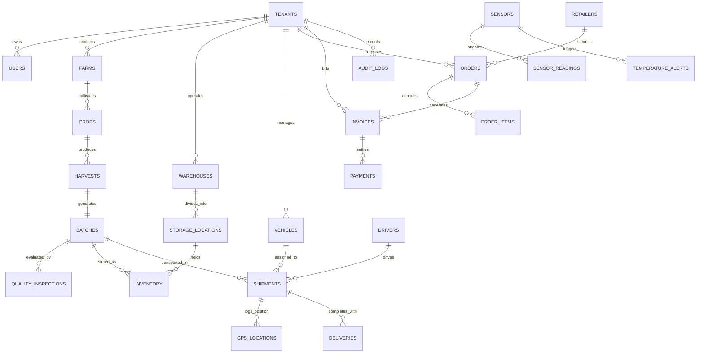

# AgriSupply Platform Database Architecture & Schema Specification

## 1. Overview & Engine Specification

The storage engine utilizes an enterprise normalized relational database schema with full ACID transaction support, foreign key referential integrity, and composite indexing.
- **Development & Single-Node Production**: SQLite 3 with Write-Ahead Logging (`PRAGMA journal_mode = WAL; PRAGMA foreign_keys = ON;`).
- **Distributed Cloud Deployment**: Direct compatibility with PostgreSQL 15+ or AWS Aurora PostgreSQL via matching DDL migrations.

---

## 2. Entity-Relationship Diagram (ERD)



---

## 3. Normalized Table Definitions (32 Core Entities)

### Core Organization & Security
1. `tenants`: Multi-tenant organizations (`id`, `name`, `subdomain`, `subscription_tier`, `created_at`).
2. `users`: Enterprise users (`id`, `tenant_id`, `email`, `password_hash`, `role`, `full_name`, `phone`, `status`).
3. `roles`: Role definitions (`id`, `name`, `description`).
4. `permissions`: Granular permission flags (`id`, `name`, `module`).
5. `user_roles`: User-role join mappings.

### Agriculture & Production
6. `farmers`: Farmer profile registry (`id`, `tenant_id`, `full_name`, `phone`, `national_id`, `certification_level`).
7. `farms`: Agricultural plots (`id`, `tenant_id`, `farmer_id`, `name`, `gps_lat`, `gps_lng`, `size_hectares`, `irrigation_type`, `soil_type`).
8. `crops`: Crop lifecycle items (`id`, `tenant_id`, `farm_id`, `variety`, `planting_date`, `estimated_harvest_date`, `expected_yield_kg`).
9. `harvests`: Harvest yield logs (`id`, `tenant_id`, `crop_id`, `harvest_date`, `quantity_kg`, `quality_estimate`).
10. `batches`: GS1-traceable produce lots (`id`, `batch_number`, `tenant_id`, `harvest_id`, `crop_name`, `quantity_kg`, `unit`, `grade`, `expiry_date`, `min_temp_c`, `max_temp_c`, `status`, `qr_code_data`).

### Quality & Compliance
11. `quality_inspections`: 10-step multi-attribute inspection logs (`id`, `tenant_id`, `batch_id`, `inspector_id`, `visual_score`, `weight_kg`, `size_mm`, `moisture_pct`, `measured_temp_c`, `packaging_integrity`, `damage_pct`, `result`, `inspector_signature`, `images_json`).
12. `inspection_fields`: Dynamic inspection form schema configurations.

### Warehousing & Cold Storage
13. `warehouses`: Logistics distribution centers (`id`, `tenant_id`, `name`, `address`, `gps_lat`, `gps_lng`, `total_capacity_kg`, `cold_rooms_count`).
14. `storage_locations`: Racks, shelves, and zones (`id`, `warehouse_id`, `zone_code`, `rack_number`, `shelf_number`, `target_temp_c`).
15. `inventory`: Active on-hand stock (`id`, `tenant_id`, `batch_id`, `warehouse_id`, `storage_location_id`, `quantity_kg`, `status`).
16. `inventory_transactions`: Inbound/outbound stock audit ledger (`id`, `tenant_id`, `batch_id`, `type`, `quantity_kg`, `reason`).

### Fleet & Cold-Chain Logistics
17. `vehicles`: Fleet vehicles (`id`, `tenant_id`, `license_plate`, `model`, `refrigeration_unit`, `cooling_capacity_c`, `status`).
18. `drivers`: Certified operators (`id`, `tenant_id`, `full_name`, `license_number`, `phone`, `status`).
19. `shipments`: Transport orders (`id`, `shipment_number`, `tenant_id`, `batch_id`, `order_id`, `vehicle_id`, `driver_id`, `origin_name`, `destination_name`, `departure_time`, `eta`, `status`).
20. `shipment_stops`: Intermediate waypoints and scheduled delivery stops.
21. `gps_locations`: High-frequency vehicle route telemetry (`id`, `tenant_id`, `shipment_id`, `vehicle_id`, `latitude`, `longitude`, `speed_kmh`, `timestamp`).
22. `geofences`: Monitored perimeters (`id`, `tenant_id`, `name`, `type`, `center_lat`, `center_lng`, `radius_meters`).
23. `geofence_events`: Entry/exit audit events (`id`, `tenant_id`, `geofence_id`, `vehicle_id`, `event_type`, `timestamp`).

### IoT Telemetry & Cold-Chain Monitoring
24. `sensors`: Hardware telemetry nodes (`id`, `device_id`, `tenant_id`, `type`, `warehouse_id`, `vehicle_id`, `min_threshold`, `max_threshold`, `battery_pct`, `status`).
25. `sensor_readings`: Time-series readings (`id`, `sensor_id`, `temperature_c`, `humidity_pct`, `timestamp`).
26. `temperature_alerts`: Cold-chain excursion incident records (`id`, `tenant_id`, `sensor_id`, `shipment_id`, `severity`, `measured_temp_c`, `threshold_c`, `status`, `notes`).

### Retail & Fulfillment
27. `retailers`: Buyer entities (`id`, `tenant_id`, `name`, `contact_name`, `email`, `phone`, `delivery_address`).
28. `orders`: Purchase orders (`id`, `order_number`, `tenant_id`, `retailer_id`, `batch_id`, `total_price`, `status`, `pipeline_stage`).
29. `deliveries`: Proof of Delivery receipts (`id`, `receipt_number`, `shipment_id`, `order_id`, `tenant_id`, `receiver_name`, `receiver_signature_data`, `delivered_qty_kg`, `damaged_qty_kg`).

### Finance, Documents, Audit & Sync
30. `invoices`: Commercial invoices (`id`, `invoice_number`, `tenant_id`, `order_id`, `total_amount`, `status`).
31. `payments`: Settled cash transactions (`id`, `tenant_id`, `invoice_id`, `amount`, `payment_method`, `status`).
32. `expenses`: Operational expenses (`id`, `tenant_id`, `category`, `amount`, `incurred_date`).
33. `documents`: File attachment repository (`id`, `tenant_id`, `title`, `file_name`, `mime_type`, `file_data_base64`).
34. `audit_logs`: Append-only security audit trail (`id`, `tenant_id`, `user_id`, `action`, `module`, `old_values`, `new_values`, `ip_address`, `timestamp`).
35. `sync_queue`: Mobile offline synchronization journal (`id`, `tenant_id`, `client_sync_id`, `entity_type`, `operation`, `payload`, `status`).

---

## 4. Indexing & Multi-Tenant Query Optimization

```sql
CREATE INDEX idx_users_tenant ON users(tenant_id, email);
CREATE INDEX idx_batches_tenant ON batches(tenant_id, status);
CREATE INDEX idx_orders_tenant ON orders(tenant_id, status, pipeline_stage);
CREATE INDEX idx_shipments_tenant ON shipments(tenant_id, status);
CREATE INDEX idx_sensors_tenant ON sensors(tenant_id, status);
CREATE INDEX idx_readings_sensor ON sensor_readings(sensor_id, timestamp);
CREATE INDEX idx_alerts_tenant ON temperature_alerts(tenant_id, status);
CREATE INDEX idx_audit_tenant ON audit_logs(tenant_id, timestamp);
CREATE INDEX idx_inventory_batch ON inventory(batch_id, warehouse_id);
```

---

## 5. Migrations & Seeding Commands

- **Run database seed script**:
  ```bash
  npm run seed
  ```
- **Reset database completely**:
  ```bash
  rm backend/data/agrisupply.db
  npm run seed
  ```
